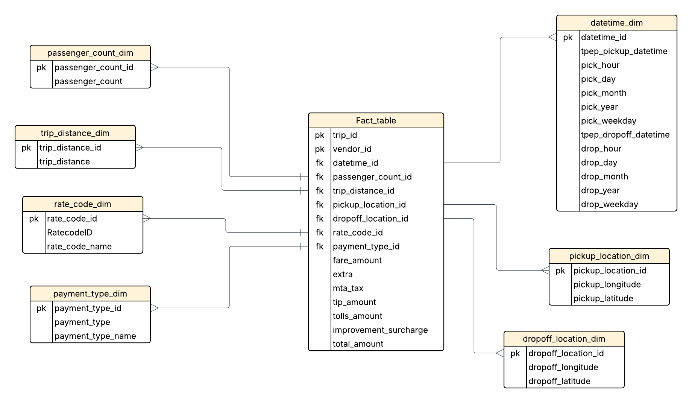

# Uber Data Analytics Project

## Overview
Interactive dashboard analyzing Uber trip patterns using Power BI and Python.

## Features
- Interactive filters for vendor, payment type, and rate codes
- Geospatial analysis of pickup/dropoff locations
- Trip distance and fare analysis
- Payment pattern visualization

## Tech Stack
- Python
- Power BI
- Pandas
- SQL

## Dashboard Screenshots

<!--  -->
## Dashboard Demo

[View Dashboard Demo Video](./assets/dashboard_demo.mp4)

## Dashboard Screenshots
[Add your screenshots here]

